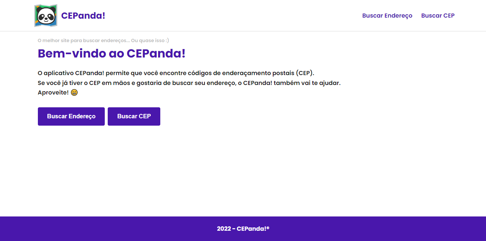
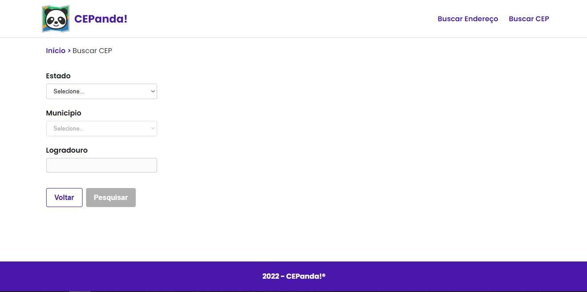
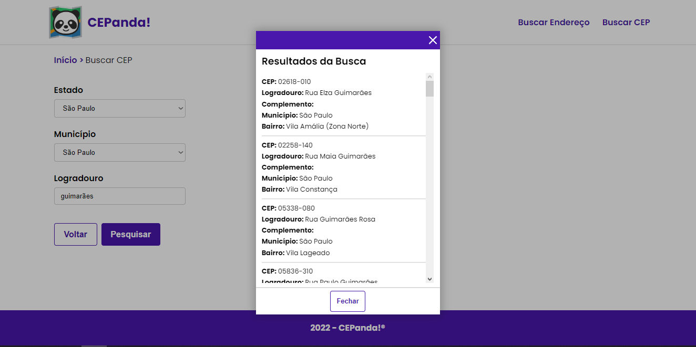
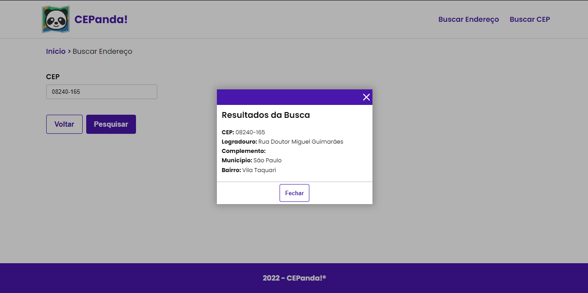
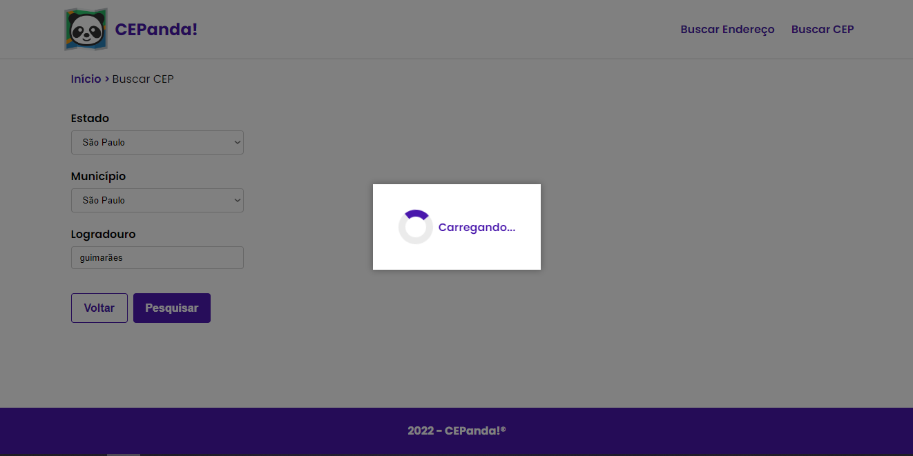
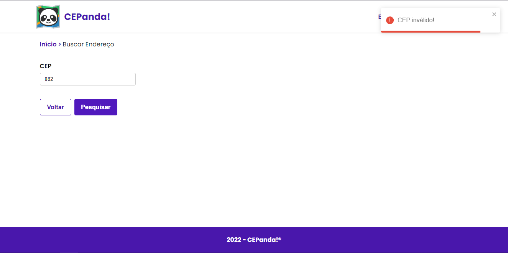

# CEPanda!: Buscador de CEPs e endereços

 

Este é um projeto feito como avaliação técnica. Consiste de uma web page onde é possível buscar um CEP com base em um endereço ou buscar um endereço com base em um CEP.

## Tecnologias

Neste projeto usei React juntamente com TypeScript, Axios e Sass.

## Instruções

Para executar esta aplicação em sua máquina, é necessário baixar este repositório ou cloná-lo. Após isso, basta entrar no diretório raiz da aplicação e instalar as dependências com o comando:

### `npm install`

Feito isso, para subir a aplicação é necessário executar o seguinte comando:

### `npm run dev`

Este comando irá subir a aplicação em modo de desenvolvimento, no endereço [http://localhost:3000](http://localhost:3000). Caso queira gerar o build do projeto, use o comando:

### `npm run build`

## Recursos

#### Homepage

#### Página para buscar CEP: formulário

#### Página para buscar CEP: resultado

#### Página para buscar endereço: resultado

#### Componente: modal de loading

#### Componente: toast de erro

#### Logo irado montado no paint

 
